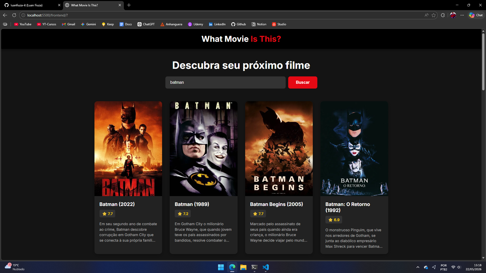
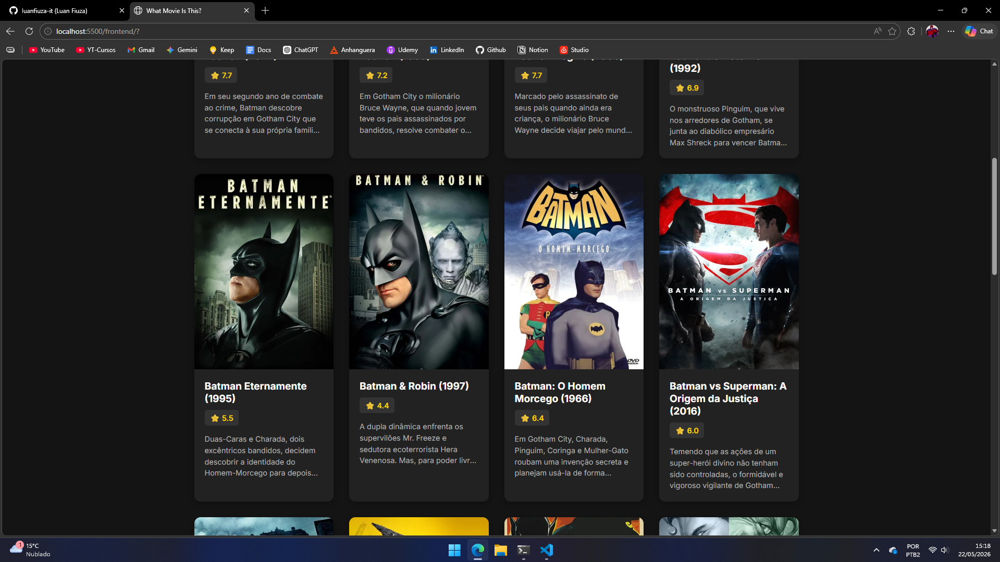

# 🎬 What Movie Is This?

Uma aplicação web interativa e dinâmica para descoberta e consulta de filmes, estruturada com um ecossistema moderno dividindo as responsabilidades entre **Backend (API)** e **Frontend (Interface do Usuário)**.

A plataforma se conecta à API oficial do TMDB (The Movie Database) para fornecer dados em tempo real sobre produções cinematográficas.

---
## 🖥️ Demonstração da Interface

  
   &nbsp;&nbsp;&nbsp;&nbsp;
  

## 🚀 O que foi feito (Arquitetura & Funcionalidades)

Durante o desenvolvimento, o projeto foi estruturado seguindo boas práticas modernas de desenvolvimento web:

### 🔹 Separação de Camadas (Decoupling)

O projeto foi dividido em duas partes principais:

- **`backend/`**
  - Construído em Python
  - Responsável por gerenciar requisições
  - Protege informações sensíveis como chaves de API
  - Atua como intermediador seguro entre frontend e TMDB

- **`frontend/`**
  - Desenvolvido com HTML5, CSS3 e JavaScript
  - Interface dinâmica e responsiva
  - Utiliza Fetch API para comunicação assíncrona com o backend
  - Atualiza os filmes na tela sem recarregar a página

---

### 🔐 Segurança e Infraestrutura Git

Foram implementadas práticas essenciais de segurança e organização:

- Uso de variáveis de ambiente (`.env`) para proteger credenciais privadas
- Configuração do `.gitignore` para impedir upload de:
  - arquivos `.env`
  - arquivos `.venv`
  - caches locais
  - arquivos temporários

---

## 🛠️ Tecnologias Utilizadas

- **Backend:** Python 3.x
- **Frontend:** HTML5, CSS3, JavaScript (ES6+)
- **API Externa:** [The Movie Database (TMDB)](https://www.themoviedb.org/)
- **Ambiente de trabalho:** Linux Ubuntu WSL2

### Para rodar a aplicação em seu computador leia:

* [**Como executar este projeto?**](./RUNNING.md): Guia de configuração e execução local.